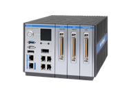
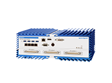
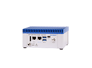
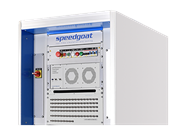

  
  
  
  # Welcome to the Speedgoat Open-Source Headquarters 👋
  
  "Rapidly innovate control designs, and thoroughly test controls with real-time digital twins and automated testing."
  
  
  

<h2 align="center">📝 Overview​</h2>

[Speedgoat](https://www.speedgoat.com) test systems are ideal for rapidly and continuously prototyping control designs and thoroughly testing embedded controllers with digital twins.

Frequent use cases include designing and testing control designs and embedded controllers at the full system, power system, and power electronics levels, such as the [electrification](https://www.speedgoat.com/solutions/testing-workflows/electrification-of-everything) of [vehicles](https://www.speedgoat.com/solutions/industries/automotive), [aircrafts](https://www.speedgoat.com/solutions/industries/aerospace), and [renewable energies](https://www.speedgoat.com/solutions/industries/power-systems/microgrids-and-renewables), for [medical devices](https://www.speedgoat.com/solutions/industries/medical-devices), and more [autonomous robotics](https://www.speedgoat.com/solutions/industries/robotic-and-autonomous-systems).

All Speedgoat systems provide unrivaled workflow integration with MATLAB® and Simulink® and can also be instrumented through MATLAB® App Designer deployed standalone graphical user interfaces and XIL interfaced test automation software environments enabled by [Simulink® Real-Time™](https://www.mathworks.com/products/simulink-real-time.html).

Some Speedgoat systems are also ideal to leverage as embedded controllers.

<h2 align="center">🔁✅ Testing Workflows​</h2>

Rapidly prototype control designs by applying [rapid control prototyping](https://www.speedgoat.com/solutions/testing-workflows/rapid-control-prototyping), test embedded controllers with
[hardware-in-the-loop](https://www.speedgoat.com/solutions/testing-workflows/hardware-in-the-loop) simulation of digital twins, and leverage Speedgoat systems as embedded controllers.

  
  
  

<h2 align="center">🖥️ Explore which Speedgoat Test System is Right for You​​</h2>
<table align="center">
  <tr>
    <td align="center">
      
       <strong><a href="https://www.speedgoat.com/products-services/real-time-target-machines/performance-real-time-target-machine">Performance</a></strong> 
      For office and lab use. 
      Large I/O expansion capabilities. 
    </td>
    <td align="center">
      
       <strong><a href="https://www.speedgoat.com/products-services/real-time-target-machines/pulse-real-time-target-machine">Pulse</a></strong> 
      Scalable Desktop System for 
      Control Design Innovation and Controller Testing 
    </td>
    <td align="center">
      
       <strong><a href="https://www.speedgoat.com/products-services/real-time-target-machines/mobile/products-services/real-time-target-machines/performance-real-time-target-machine">Mobile</a></strong> 
      For field and harsh environments. 
      Withstand shock and vibration. 
    </td>
  </tr>
  <tr>
    <td align="center">
      
       <strong><a href="https://www.speedgoat.com/products-services/real-time-target-machines/baseline/products-services/real-time-target-machines/baseline-real-time-target-machine">Baseline</a></strong> 
      Entry-level solution for 
      office to in-vehicle operation. 
    </td>
    <td align="center">
      
       <strong><a href="https://www.speedgoat.com/products-services/real-time-target-machines/unit-real-time-target-machine">Unit</a></strong> 
      Small form factor for 
      desktop and field testing, 
      and embedded deployment. 
    </td>
    <td align="center">
      
       <strong><a href="https://www.speedgoat.com/products-services/rack-systems">Tailored Rack-System</a></strong> 
      Modular rack system 
      with customization services. 
    </td>
    <td colspan="2"></td>
  </tr>
</table>

<h2 align="center">📥 Access Reference Examples</h2>

All examples are available for verified Speedgoat customers via the  **[Speedgoat Customer Portal](https://www.speedgoat.com/customerportal)**  
Use your registered account to download files for the specific MATLAB version you are working with.

<h2 align="center">▶️ How-to videos</h2>

<h2 align="center">🌐 Follow Us</h2>

 

